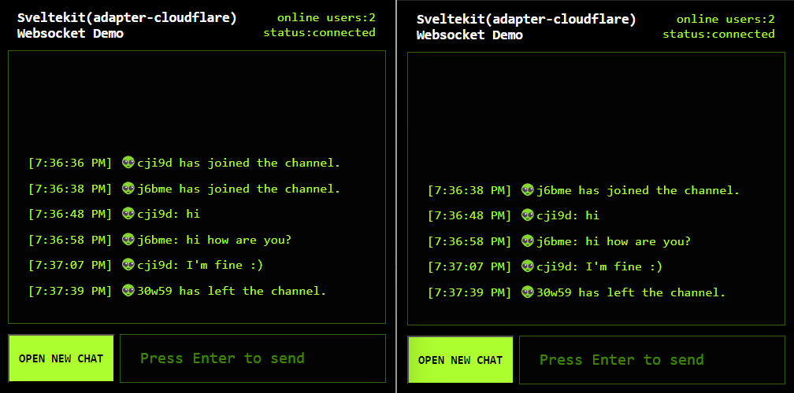

# sk-cf-ws-demo

### Use sveltekit to build a cloudflare page width websocket.

- [Preview online](https://sk-cf-ws-demo.pages.dev)

- vite plugin [vite-sveltekit-cf-ws](https://github.com/aolose/vite-sveltekit-cf-ws)

